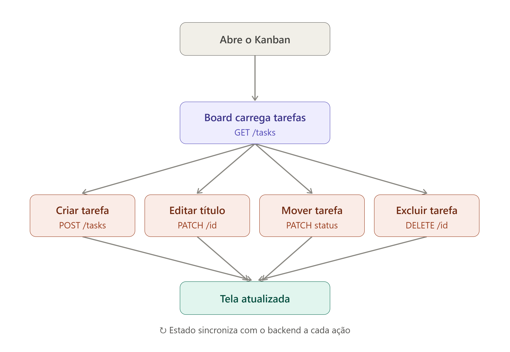

# Mini Kanban Fullstack

Aplicação de quadro Kanban para gerenciamento de tarefas, com CRUD completo e movimentação por drag-and-drop entre colunas. Desenvolvido como desafio técnico do processo seletivo.

## Tecnologias

**Backend**
- Go (net/http da biblioteca padrão, sem framework externo)
- CORS configurado via middleware próprio

**Frontend**
- React (Vite)
- @dnd-kit (drag-and-drop)
- CSS puro (Flexbox)

## Como rodar o projeto

### Pré-requisitos
- Go 1.26+ instalado
- Node.js 24+ instalado

### Backend

```bash
cd backend
go run main.go
```

O servidor sobe em `http://localhost:8080`.

### Frontend

Em outro terminal:

```bash
cd frontend
npm install
npm run dev
```

A aplicação abre em `http://localhost:5173`.

> Os dois servidores (backend e frontend) precisam estar rodando simultaneamente.

## Estrutura do projeto

kanban-fullstack/
├── backend/
│ └── main.go # API REST com CRUD de tarefas
├── frontend/
│ └── src/
│ ├── components/
│ │ ├── Column.jsx # Renderiza uma coluna e suas tarefas
│ │ └── TaskCard.jsx # Card individual, arrastável e editável
│ └── App.jsx # Estado global, fetch da API, orquestração
└── README.md


## Funcionalidades

- ✅ Criar tarefa
- ✅ Listar tarefas por coluna (status)
- ✅ Editar título da tarefa
- ✅ Mover tarefa entre colunas via drag-and-drop
- ✅ Excluir tarefa

## Decisões técnicas

**Por que `net/http` puro, sem framework (Gin, Fiber, etc.)?**
Sendo um projeto pequeno, com poucas rotas, optei por explorar a biblioteca padrão do Go antes de adicionar uma dependência externa. Isso ajudou a entender os fundamentos de roteamento HTTP, JSON encoding/decoding e middlewares (usado para CORS) sem abstrações extras.

**Por que @dnd-kit para o drag-and-drop?**
É uma biblioteca moderna, ativamente mantida, e com boa separação entre "elementos arrastáveis" (`useDraggable`) e "zonas de destino" (`useDroppable`) — o que se encaixou bem na estrutura de componentes (`Column` como zona de destino, `TaskCard` como item arrastável).

**Persistência dos dados**
As tarefas são armazenadas em memória (slice em Go), sem banco de dados. Para o escopo deste desafio, isso é suficiente — os dados são reiniciados a cada restart do servidor.

**Geração de IDs**
As tarefas recebem IDs através de um contador incremental (`nextID`), garantindo unicidade mesmo após exclusões — evitando colisões que ocorreriam com uma abordagem baseada no tamanho da lista (`len(tasks) + 1`).

## Fluxo de dados no frontend

O estado das tarefas vive centralizado no componente `App`, que busca os dados do backend e distribui via *props* para os componentes filhos (`Column` → `TaskCard`), seguindo o fluxo unidirecional característico do React. Ações do usuário (criar, editar, excluir, mover) dependem de funções também definidas em `App` e passadas como props, garantindo que só o componente "dono" do estado o modifique diretamente.

## Diagrama de User Flow
 